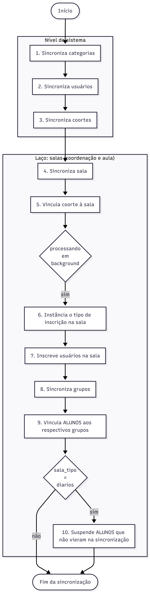

SUAP → Moodle Synchronization
=============================

This guide explains what happens behind the scenes in Moodle when the ``sync_up_enrolments`` service (see :doc:`api`) receives a course/class structure from SUAP.

Practical Summary
-----------------

As an educator or administrator, the practical result after synchronization is:

1. **Organized rooms**: campus, course, and term folders organized without manual effort.
2. **Ready rooms**: logbook room and course coordination room created automatically in the corresponding category.
3. **Right people in the right places**: students and teachers enrolled with active or suspended status in sync with SUAP Edu.
4. **Group management**: students automatically split into groups by hub, entry period, or class inside each room.

Vocabulary
----------

``SUAP``
   The Enterprise Resource Planning (ERP) system developed by IFRN.

``SUAP Edu``
   Academic management module of SUAP; holds official academic records (enrolments, grades, personal data).

``Moodle``
   The Virtual Learning Environment (VLE / LMS) hosting online virtual classrooms.

``Integrador AVA``
   Middleware bridging SUAP data and Moodle (the HTTP client calling ``sync_up_enrolments``).

``AVA Panel``
   Unified web interface for accessing rooms across multiple Moodle instances.

``Category``
   Moodle course category.

``Room``
   Moodle course (virtual classroom).

``User``
   Moodle user account, matching a SUAP account 1-to-1.

``Enrolment``
   Moodle enrolment associated with role assignments.

``Group``
   Moodle course group.

``Cohort``
   Moodle system-wide site cohort.

Synchronization Execution
-------------------------

Synchronization is triggered by HTTP calls to ``sync_up_enrolments``:

* **Synchronous**: if payload contains ``"sincrono": true``, processing happens directly in the HTTP request.
* **Asynchronous (Default)**: structure is created instantly and an adhoc task (``sync_up_enrolments_task``) processes user enrolments, groups, and suspensions in background.

Synchronization Flow in Moodle
------------------------------

In each execution, Moodle processes two room types:

* Once for the course **coordination room**;
* Once for the student **classroom** (logbook/diário, self-enrolment, practicals, or models).

Step-by-Step Breakdown
----------------------

1. Category Sync
~~~~~~~~~~~~~~~~
Guarantees category hierarchy: Root (Diários) → Campus → Course → Term → Class (Turma). Missing folders are automatically created.

2. User Sync
~~~~~~~~~~~~
Creates missing accounts (with authentication method resolved by ``auths_mapping``/``default_auth``) and updates profile fields (email, name, hub, program).

3. Cohort Sync
~~~~~~~~~~~~~~
Creates or updates system-wide cohorts and adds cohort members.

4. Room/Course Sync
~~~~~~~~~~~~~~~~~~~
Classifies room type (``coordenacoes``, ``autoinscricoes``, ``praticas``, ``modelos``, ``diarios``) and sets custom course fields. New rooms are created hidden (``visible = 0``).

5. Cohort Linking
~~~~~~~~~~~~~~~~~
Enrols cohort into room using ``enrol_cohort`` method.

6. Enrolment Method Instantiation
~~~~~~~~~~~~~~~~~~~~~~~~~~~~~~~~~
Ensures required enrolment instance exists in room according to ``roles_mapping``.

7. User Enrolment
~~~~~~~~~~~~~~~~~
Enrols users with assigned roles; suspends accounts (``ENROL_USER_SUSPENDED``) if user status in SUAP is inactive.

8 & 9. Group Sync & Student Group Assignment
~~~~~~~~~~~~~~~~~~~~~~~~~~~~~~~~~~~~~~~~~~~~
Subdivides students inside room into Entry, Class, Hub, and Program groups.

10. Automatic Suspension of Missing Students
~~~~~~~~~~~~~~~~~~~~~~~~~~~~~~~~~~~~~~~~~~~~~
For ``diarios`` room type: suspends enrolled students who are no longer listed in the latest SUAP synchronization payload.

Technical Architecture Reference
--------------------------------

Primary orchestration in ``api/sync_up_enrolments.php`` (``sync_up_enrolments_service::process()``):

.. code-block:: text

   sync_categories() → sync_users() → sync_cohorts()
     → for each room type (coordination, classroom):
         sync_course() → sync_enrols_cohorts()
           → if synchronous/background worker:
               sync_enrols_manuals() → sync_enrolments() → sync_groups()
                 → if room_type == 'diarios':
                     suspend_students_not_in_list_all_enrols()
