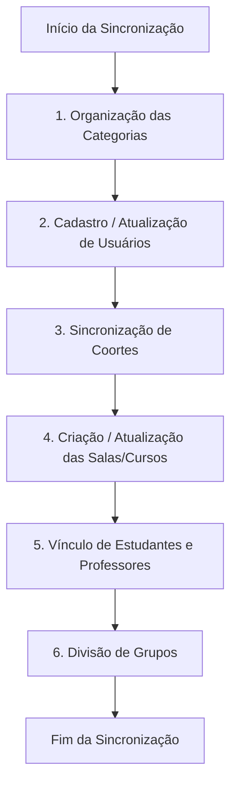

# O que ocorre ao Sincronizar (Integração SUAP -> Moodle/AVA)

Este guia prático foi elaborado didaticamente para **coordenadores de curso**, com o objetivo de explicar o que acontece "por trás dos bastidores" no Moodle (Ambiente Virtual de Aprendizagem - AVA) quando ocorre a sincronização de dados vindos do SUAP.

A integração é coordenada principalmente pelo arquivo técnico [sync_up_enrolments.php](file:///home/kelson/projetos/IFRN/suap-ava-suite/local_suap/api/sync_up_enrolments.php), que gerencia a criação, atualização e organização de salas, diários, usuários, coortes, matrículas e grupos.

---

## 🌐 O Ecossistema de Integração do IFRN

Para entender a sincronização, é importante compreender o papel de cada sistema:
1. **SUAP (ERP / Módulo Acadêmico):** É onde reside o registro acadêmico oficial (matrículas, notas oficiais, dados pessoais, vínculos). **Não é onde as aulas acontecem.**
2. **AVA (Moodle):** É a sala de aula virtual. É onde ocorre o processo de ensino-aprendizagem. Nenhuma informação acadêmica oficial é gerada diretamente aqui; ela é apenas refletida a partir do SUAP.
3. **Painel AVA & Integrador:** Fazem a ponte que traduz os dados do SUAP para o Moodle de forma automatizada.

---

## 🧭 O Fluxo de Sincronização no Moodle

Quando a sincronização é acionada (geralmente por ações no SUAP ou agendamento de tarefas), o Moodle realiza um processo em cadeia dividido em **6 etapas principais**:

---

### 📂 1. Organização da Estrutura de Categorias
As categorias funcionam como as pastas do computador para manter as salas organizadas. A sincronização garante a seguinte hierarquia padrão:
* **Pasta Raiz (Diários):** Pasta principal que contém todos os diários.
* **Subpasta Campus:** Ex: *Natal-Zona Leste*.
* **Subpasta Curso:** Criada para o seu curso (ex: *Tecnologia em Sistemas para Internet*).
* **Subpasta Semestre:** Organiza os diários por ano e período letivo (ex: *2026.1*).
* **Subpasta Turma:** A pasta final contendo as salas específicas de uma turma.

*Se alguma dessas pastas ainda não existir no Moodle, ela é criada automaticamente.*

---

### 👤 2. Cadastro e Atualização de Usuários (Estudantes e Servidores)
O Moodle verifica todos os usuários envolvidos na sincronização (professores, alunos e equipe de apoio):
* **Criação de novos usuários:** Se um aluno acabou de se matricular ou um professor foi contratado, a conta é criada no Moodle. O login padrão é configurado conforme as regras do IFRN (CPF ou Matrícula em letras minúsculas).
* **Atualização de dados:** Se houver alteração de e-mail, nome usual, nome social ou CPF no SUAP, essas informações são atualizadas no perfil do Moodle.
* **Metadados do Perfil:** Informações como *Polo de Apoio Presencial*, *Programa*, *Modalidade do Curso* e *Campus* são gravadas nos campos personalizados do perfil do usuário para relatórios posteriores.

---

### 👥 3. Sincronização de Coortes (Grupos Globais)
As coortes são grupos de usuários a nível do sistema Moodle (geralmente equipes pedagógicas, coordenação ou apoio ao campus):
* O sistema cria ou atualiza as coortes no Moodle (ex: a coorte de colaboradores do curso).
* Adiciona ou remove membros nessas coortes de acordo com a listagem atualizada do SUAP.

---

### 🏫 4. Criação e Atualização dos Cursos (Salas Virtuais)
A sincronização gerencia dois tipos principais de salas:
1. **Diários de Classe (Salas de Disciplina):** Salas virtuais criadas dentro da categoria da Turma.
2. **Salas de Coordenação de Curso:** Salas de apoio criadas dentro da categoria do Curso.

* Durante esta etapa, o Moodle insere informações e metadados nos campos personalizados do curso (ex: carga horária, tipo de disciplina, se exige auto-inscrição, se é uma sala de coordenação, etc.).
* A sala é criada inicialmente como **oculta** (invisível para os alunos) para que o professor possa organizar o conteúdo antes de disponibilizá-la.

---

### 🔐 5. Vínculo de Alunos e Professores (Matrículas / Enrolments)
Aqui é definido **quem** pode acessar cada sala virtual e com **qual papel** (Estudante, Professor, Equipe, etc.):
* **Inscrição de Usuários:** Professores e estudantes ativos no SUAP são inscritos na sala correspondente.
* **Atualização de Status (Ativo/Suspenso):** 
  * Se a situação do estudante/servidor no SUAP for **Ativa**, o acesso no Moodle é liberado/mantido ativo.
  * Se o estudante trancou a matrícula, cancelou ou foi desligado no SUAP, o Moodle altera o status da sua inscrição para **Suspenso** (`ENROL_USER_SUSPENDED`). O aluno não perde suas atividades já realizadas, mas deixa de acessar a sala virtual.
  * **Limpeza Automática:** Se um estudante estava inscrito no diário no Moodle mas seu nome **não consta mais** na lista oficial enviada pelo SUAP, sua matrícula naquela sala específica é suspensa automaticamente para garantir a conformidade dos dados.

---

### 👪 6. Organização em Grupos (Groups)
Dentro da sala virtual (curso), os estudantes são subdivididos de forma automatizada para facilitar o gerenciamento pedagógico pelo professor:
* **Tipos de grupos criados:**
  * **Grupo de Entrada:** Agrupa estudantes pelo ano e semestre em que ingressaram (ex: *20251*).
  * **Grupo de Turma:** Agrupa pela sigla/código da turma no SUAP.
  * **Grupo de Polo:** Útil em cursos EAD, agrupa estudantes pelo polo de apoio presencial (ex: *Polo Macau*).
  * **Grupo de Programa:** Agrupa pelo programa acadêmico (ex: *Institucional*).
* O Moodle analisa quem já está no grupo e adiciona os novos alunos faltantes. Se um grupo não existia na sala, ele é criado na hora.

---

## ⚙️ Sincronização de Preferências Individuais

Além de estruturar os cursos e matrículas, o sistema também permite a sincronização rápida de preferências de interface do usuário através do arquivo [sync_user_preference.php](file:///home/kelson/projetos/IFRN/suap-ava-suite/local_suap/api/sync_user_preference.php). 
Isso permite que pequenas alterações visuais e configurações personalizadas (como favoritar um curso ou expandir um menu) feitas por você ou pelos alunos no Moodle reflitam de imediato em outros pontos integrados da rede do IFRN.

---

## 🎯 Resumo Prático para o Coordenador

Como coordenador, o resultado prático que você verá no Moodle após a sincronização é:
1. **Salas Organizadas:** Pastas de campus, curso e semestre organizadas sem esforço manual.
2. **Salas Prontas:** Diários de classe e Salas de Coordenação criados automaticamente na categoria correspondente.
3. **Pessoas Certas nos Lugares Certos:** Alunos e professores inscritos com acesso ativo ou suspenso em total sincronia com o SUAP Acadêmico.
4. **Facilidade de Gestão:** Estudantes já divididos em grupos por polo ou período de ingresso dentro de cada disciplina.
