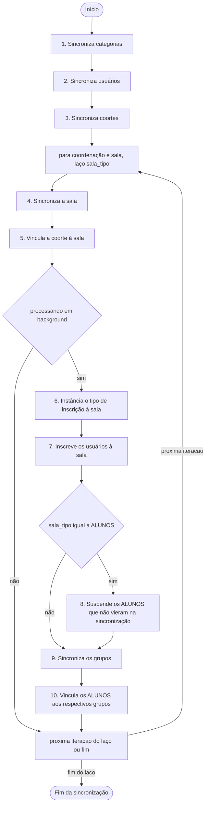

# O que ocorre ao sincronizar (SUAP -> Moodle)

Este guia prático foi elaborado didaticamente para os **colaboradores da educação**, que usam a **SUAP/AVA Suite", 
com o objetivo de explicar o que acontece "por trás dos bastidores" no Moodle (Ambiente Virtual de Aprendizagem - AVA)
quando ocorre a sincronização de dados vindos do SUAP, desconsiderando as questões técnicas próprias de Tecnologia da
Informação e Comunicação (TIC).

## Verbetes

- **SUAP**: é o Software de Planejamento de Recursos Empresariais (Enterprise Resource Planning - ERP) construído pelo 
nstituto Federal de Educação, Ciência e Tecnologia do Estado do Rio Grande do Norte (IFRN)
- **SUAP Edu**: é o módulo do SUAP que faz as vezes de um Sistema de Gestão Acadêmica (SGA), é onde reside o registro
acadêmico oficial (matrículas, notas oficiais, dados pessoais, vínculos). **Não é onde as aulas acontecem.** 
TODA informação acadêmica oficial é gerida aqui
- **Moodle:** é a plataforma do Ambiente Virtual de Aprendizagem (AVA ou LMS - Learning Management System) que hospeda
as salas de aula virtuais do IFRN. **É onde ocorre o processo de ensino-aprendizagem.** 
NENHUMA informação acadêmica oficial é gerada diretamente aqui; ela é apenas refletida a partir do SUAP (inscrições) e 
só é oficial após retornar ao SUAP (notas)
- **Integrador AVA:** é a ponte entre os dados do SUAP para o Moodle de forma automatizada, literalmente, um middleware
entre que viabiliza esta integração
- **Painel AVA:** é uma interface que unifica para o usuário as salas de diversos Moodle
- **Sincronizar**: ou **sincronização** indica o processo de cadastrar, alterar ou remover categoria, sala, usuário, 
inscrição, grupo, vinculação a grupo, etc
- **Categoria**: equivale a uma **category** no Moodle
- **Sala**: equivale a um **course** no Moodle, não usamos o termo curso pois na educação o termo curso tem outro 
significado e conflitaria com o termo curso, tipos de salas:
   - **Sala de coordenação de curso**: (chave: `coordenacoes`) para cada curso, de cada campus, sendo uma sala de 
   coordenação para cada curso
   - **Autoinscrição**: (chave: `autoinscricoes`) para cada turma de curso **FIC < 160h** é criada uma sala para que os
   alunos se autoinscrevam, só docentes e coortes são sincronizado na ida para o Moodle, na volta para o SUAP os alunos
   que concluíram mai do que X% do curso e obtiveram nota superior a X serão matriculados e marcados como concluintes
   - **Laboratório individual de prática de docencia em EaD**: (chave: `praticas`) para cada aluno de um curso de 
   formação em EaD é criada uma sala com esse propósito, sendo inseridos o aluno e professor com algum papel de docencia
   - **Modelo de sala**: (chave: `modelos`) quando um docente necessita de uma sala para construir a estrutura de uma 
   sala é criada uma sala deste tipo (*atenção a isso*):
   - **Diário**: (chave: `diarios`) se não for de nenhum dos tipos acima, será um diário, sendo que:
      - em **curso tradicional**, 1 **diário** no SUAP equivale a 1 sala deste tipo no Moodle
      - em **FIC < 160h**, 1 **turma** no SUAP equivale a 1 sala deste tipo no Moodle
- **Usuário**: equivale a um **course** no Moodle, qualquer uma das contas de alguma pessoa, normalmente em relação 
1 para 1 com uma conta no SUAP
- **Docente**: professsor formador, professsor conteudista, professsor principal, tutor ou mediador
- **Inscrição**: equivale a um **enrolment** em um ou mais **role assign** no Moodle, o usuário pode ter várias 
inscrições em uma sala, assim como vários **role assign**, especialmente quando envolve os educadores, de alunos 
espera-se apenas 1 inscrição.
- **Grupo**: equivale a um **group** no Moodle, sendo uma forma de agrupar usuário em um curso para realização de 
ativades coletivas
- **Agrupamento**: equivale a um **groupings groups** no Moodle, ou seja, um grupo de grupos, a Suite não lida com este 
cenário
- **Coorte**: equivale a um **cohort** no Moodle, sendo um grupo global usuários, que se difere do **grupo**, que é por 
curso, serve para inscrever/deinscrever automaticamente o usuário nos cursos onde a **coorte** tenha sido adicionada
- **Vinculação**: equivale a um **group member** no Moodle, indica vinculo de um usuário a um grupo no Moodle ou a uma 
coorte
- **Curso**: não há equivalente no Moodle, o **course** do Moodle equivale a uma **Sala**, cabendo ao escopo 
de gestão acadêmica no SUAP, ainda que para cada **curso** seja crida uma **categoria** no Moodle
- **Turma**: não há equivalente no Moodle, cabendo ao escopo de gestão acadêmica no SUAP, ainda que para cada 
**turma** seja crida uma **categoria** no Moodle e que para cada **turma** POSSA ser criado um **grupo** na sala e o 
aluno vinculado a ele
- **Polo**: não há equivalente no Moodle, cabendo ao escopo de gestão acadêmica no SUAP, ainda que para cada 
**polo** POSSA ser criado um **grupo** no Moodle e o aluno vinculado a ele
- **Programa**: não há equivalente no Moodle, cabendo ao escopo de gestão acadêmica no SUAP, ainda que para cada 
**programa** POSSA ser criado um **grupo** no Moodle e o aluno vinculado a ele
- **Disciplina**: ou **componente curricular**, não há equivalente no Moodle, cabendo ao escopo de gestão acadêmica 
no SUAP, não confundir com o **Diário**
- **Média da etapa**: equivale à nota de uma **categoria de notas** no quadro de notas do Moodle, sendo mapeadas para 
`N1` (média da etapa 1), `N2` (média da etapa 2), `N3` (média da etapa 3) ou `N4` (média da etapa 4), a depender do 
Projeto Político Pedagógico do Curso (PPC) em sua instituição, no campo `idnumber` da categoria de notas
- **Nota da avaliação final**: equivale à nota de uma **categoria de notas** no quadro de notas do Moodle, 
sendo mapeadas para `NAF`, só deve ser disponibiliza nas configurações do quadro de notas para os alunos que precisaram
ir para a atividade final de recuperação do "diário"
Projeto Político Pedagógico do Curso (PPC) em sua instituição, no campo `idnumber` da categoria de notas
- **Média do diário**: não há equivalente no Moodle, é calculado pelo próprio SUAP, independe da nota vir do 
Moodle ou ser lançada manualmente pelo docente, conforme PPC
- **Média final do diário**: não há equivalente no Moodle, é calculado pelo próprio SUAP, independe da nota vir do 
Moodle ou ser lançada manualmente pelo docente, conforme PPC

## O fluxo de sincronização no Moodle

Quando a sincronização é acionada (seja por ações ou agendamento de tarefas no SUAP), o Moodle realiza um processo em cadeia dividido em **10 etapas principais**:

---

### 📂 1. Organização da Estrutura de Categorias
As categorias funcionam como as pastas do computador para manter as salas organizadas. A sincronização garante a seguinte hierarquia padrão:
* **Pasta Raiz (Diários):** Pasta principal que contém todos os diários.
* **Subpasta Campus:** Ex: *Natal-Zona Leste*.
* **Subpasta Curso:** Criada para o seu curso (ex: *Tecnologia em Sistemas para Internet*).
* **Subpasta Semestre:** Organiza os diários por ano e período letivo (ex: *2026.1*).
* **Subpasta Turma:** A pasta final contendo as salas específicas de uma turma.

*Se alguma dessas pastas ainda não existir no Moodle, ela é criada automaticamente.*

---

### 👤 2. Cadastro e Atualização de Usuários (Estudantes e Servidores)
O Moodle verifica todos os usuários envolvidos na sincronização (professores, alunos e equipe de apoio):
* **Criação de novos usuários:** Se um aluno acabou de se matricular ou um professor foi contratado, a conta é criada no Moodle. O login padrão é configurado conforme as regras do IFRN (CPF ou Matrícula em letras minúsculas).
* **Atualização de dados:** Se houver alteração de e-mail, nome usual, nome social ou CPF no SUAP, essas informações são atualizadas no perfil do Moodle.
* **Metadados do Perfil:** Informações como *Polo de Apoio Presencial*, *Programa*, *Modalidade do Curso* e *Campus* são gravadas nos campos personalizados do perfil do usuário para relatórios posteriores.

---

### 👥 3. Sincronização de Coortes (Grupos Globais)
As coortes são grupos de usuários a nível do sistema Moodle (geralmente equipes pedagógicas, coordenação ou apoio ao campus):
* O sistema cria ou atualiza as coortes no Moodle (ex: a coorte de colaboradores do curso).
* Adiciona ou remove membros nessas coortes de acordo com a listagem atualizada do SUAP.

---

### 🏫 4. Criação e Atualização dos Cursos (Salas Virtuais)
A sincronização gerencia dois tipos principais de salas:
1. **Diários de Classe (Salas de Disciplina):** Salas virtuais criadas dentro da categoria da Turma.
2. **Salas de Coordenação de Curso:** Salas de apoio criadas dentro da categoria do Curso.

* Durante esta etapa, o Moodle insere informações e metadados nos campos personalizados do curso (ex: carga horária, tipo de disciplina, se exige auto-inscrição, se é uma sala de coordenação, etc.).
* A sala é criada inicialmente como **oculta** (invisível para os alunos) para que o professor possa organizar o conteúdo antes de disponibilizá-la.

---

### 🔐 5. Vínculo de Alunos e Professores (Matrículas / Enrolments)
Aqui é definido **quem** pode acessar cada sala virtual e com **qual papel** (Estudante, Professor, Equipe, etc.):
* **Inscrição de Usuários:** Professores e estudantes ativos no SUAP são inscritos na sala correspondente.
* **Atualização de Status (Ativo/Suspenso):** 
  * Se a situação do estudante/servidor no SUAP for **Ativa**, o acesso no Moodle é liberado/mantido ativo.
  * Se o estudante trancou a matrícula, cancelou ou foi desligado no SUAP, o Moodle altera o status da sua inscrição para **Suspenso** (`ENROL_USER_SUSPENDED`). O aluno não perde suas atividades já realizadas, mas deixa de acessar a sala virtual.
  * **Limpeza Automática:** Se um estudante estava inscrito no diário no Moodle mas seu nome **não consta mais** na lista oficial enviada pelo SUAP, sua matrícula naquela sala específica é suspensa automaticamente para garantir a conformidade dos dados.

---

### 👪 6. Organização em Grupos (Groups)
Dentro da sala virtual (curso), os estudantes são subdivididos de forma automatizada para facilitar o gerenciamento pedagógico pelo professor:
* **Tipos de grupos criados:**
  * **Grupo de Entrada:** Agrupa estudantes pelo ano e semestre em que ingressaram (ex: *20251*).
  * **Grupo de Turma:** Agrupa pela sigla/código da turma no SUAP.
  * **Grupo de Polo:** Útil em cursos EAD, agrupa estudantes pelo polo de apoio presencial (ex: *Polo Macau*).
  * **Grupo de Programa:** Agrupa pelo programa acadêmico (ex: *Institucional*).
* O Moodle analisa quem já está no grupo e adiciona os novos alunos faltantes. Se um grupo não existia na sala, ele é criado na hora.

### Observações

- Um usuário pode estar em vários grupos na sala, mas isso tende a complicar para todos os usuários no processo de 
ensino-aprendizagem pois o usuário tem que ficar escolhendo em qual grupo que fazer cada atividade. Não recomendamos.
- A Suite até dá a opção de se trabalhar com multiplas vinculações em uma sala, mas desencorajamos a prática.

## ⚙️ Sincronização de Preferências Individuais

Além de estruturar os cursos e matrículas, o sistema também permite a sincronização rápida de preferências de interface do usuário através do arquivo [sync_user_preference.php](file:///home/kelson/projetos/IFRN/suap-ava-suite/local_suap/api/sync_user_preference.php). 
Isso permite que pequenas alterações visuais e configurações personalizadas (como favoritar um curso ou expandir um menu) feitas por você ou pelos alunos no Moodle reflitam de imediato em outros pontos integrados da rede do IFRN.

---

## 🎯 Resumo Prático para o Coordenador

Como coordenador, o resultado prático que você verá no Moodle após a sincronização é:
1. **Salas Organizadas:** Pastas de campus, curso e semestre organizadas sem esforço manual.
2. **Salas Prontas:** Diários de classe e Salas de Coordenação criados automaticamente na categoria correspondente.
3. **Pessoas Certas nos Lugares Certos:** Alunos e professores inscritos com acesso ativo ou suspenso em total sincronia com o SUAP Acadêmico.
4. **Facilidade de Gestão:** Estudantes já divididos em grupos por polo ou período de ingresso dentro de cada disciplina.
