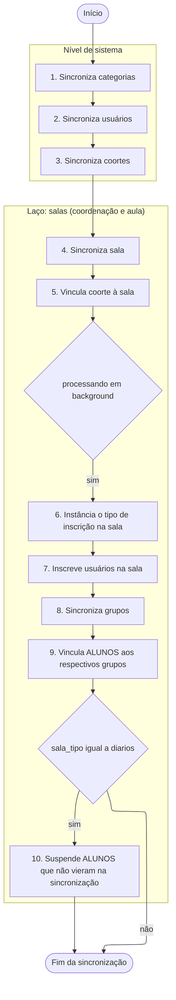

# O que ocorre ao sincronizar (SUAP -> Moodle)

Este guia prático foi elaborado didaticamente para os **colaboradores da educação**, que usam a **SUAP/AVA Suite**, 
com o objetivo de explicar o que acontece "por trás dos bastidores" no Moodle (Ambiente Virtual de Aprendizagem - AVA)
quando ocorre a sincronização de dados vindos do SUAP, desconsiderando as questões técnicas próprias de Tecnologia da
Informação e Comunicação (TIC).

## Resumo prático

Como colaborador em educação, o resultado prático que você verá no Moodle após a sincronização é:
1. **Salas organizadas:** Pastas de campus, curso e semestre organizadas sem esforço manual.
2. **Salas prontas:** Sala de diários e coordenação de curso criadas automaticamente na categoria correspondente.
3. **Pessoas certas nos lugares certos:** Alunos e professores inscritos com acesso ativo ou suspenso em total
sincronia com o SUAP Edu.
4. **Facilidade de gestão:** Estudantes já divididos em grupos por polo ou período de ingresso dentro de cada
disciplina.

## Vocabulário

- **SUAP**: é o Software de Planejamento de Recursos Empresariais (Enterprise Resource Planning - ERP) construído pelo 
Instituto Federal de Educação, Ciência e Tecnologia do Estado do Rio Grande do Norte (IFRN)
- **SUAP Edu**: é o módulo do SUAP que faz as vezes de um Sistema de Gestão Acadêmica (SGA), é onde reside o registro
acadêmico oficial (matrículas, notas oficiais, dados pessoais, vínculos). **Não é onde as aulas acontecem.** 
TODA informação acadêmica oficial é gerida aqui
- **Moodle:** é a plataforma do Ambiente Virtual de Aprendizagem (AVA ou LMS - Learning Management System) que hospeda
as salas de aula virtuais do IFRN. **É onde ocorre o processo de ensino-aprendizagem.** 
NENHUMA informação acadêmica oficial é gerada diretamente aqui; ela é apenas refletida a partir do SUAP (inscrições) e 
só é oficial após retornar ao SUAP (notas)
- **Integrador AVA:** é a ponte entre os dados do SUAP para o Moodle de forma automatizada, literalmente, um middleware
entre que viabiliza esta integração
- **Painel AVA:** é uma interface que unifica para o usuário as salas de diversos Moodle
- **Sincronizar**: ou **sincronização** indica o processo de cadastrar, alterar ou remover categoria, sala, usuário, 
inscrição, grupo, vinculação a grupo, etc, tanto de SUAP para Moodle quanto de Moodle de volta para SUAP
(no caso de notas)
- **Categoria**: equivale a uma **category** no Moodle
- **Sala**: equivale a um **course** no Moodle, não usamos o termo curso pois na educação o termo curso tem outro 
significado e conflitaria com a terminologia acadêmica.
- **Usuário**: equivale a um **user** no Moodle, qualquer uma das contas de alguma pessoa, normalmente em relação 
1 para 1 com uma conta no SUAP
- **Docente**: professor formador, professor conteudista, professor principal, tutor ou mediador
- **Inscrição**: equivale a um **enrolment** em um ou mais **role assign** no Moodle, o usuário pode ter várias 
inscrições em uma sala, assim como vários **role assign**, especialmente quando envolve os educadores, de alunos 
espera-se apenas 1 inscrição.
- **Grupo**: equivale a um **group** no Moodle, sendo uma forma de agrupar usuário em um curso para realização de 
atividades coletivas
- **Agrupamento**: equivale a um **groupings groups** no Moodle, ou seja, um grupo de grupos, a Suite não lida com este 
cenário
- **Coorte**: equivale a um **cohort** no Moodle, sendo um grupo global usuários, que se difere do **grupo**, que é por 
curso, serve para inscrever/deinscrever automaticamente o usuário nos cursos onde a **coorte** tenha sido adicionada
- **Vinculação**: equivale a um **group member** no Moodle, indica vinculo de um usuário a um grupo no Moodle ou a uma 
coorte
- **Curso**: não há equivalente no Moodle, o **course** do Moodle equivale a uma **Sala**, cabendo ao escopo 
de gestão acadêmica no SUAP, ainda que para cada **curso** seja criada uma **categoria** no Moodle
- **Turma**: não há equivalente no Moodle, cabendo ao escopo de gestão acadêmica no SUAP, ainda que para cada 
**turma** seja criada uma **categoria** no Moodle e que para cada **turma** POSSA ser criado um **grupo** na sala e o 
aluno vinculado a ele
- **Polo**: não há equivalente no Moodle, cabendo ao escopo de gestão acadêmica no SUAP, ainda que para cada 
**polo** POSSA ser criado um **grupo** no Moodle e o aluno vinculado a ele
- **Programa**: não há equivalente no Moodle, cabendo ao escopo de gestão acadêmica no SUAP, ainda que para cada 
**programa** POSSA ser criado um **grupo** no Moodle e o aluno vinculado a ele
- **Disciplina**: ou **componente curricular**, não há equivalente no Moodle, cabendo ao escopo de gestão acadêmica 
no SUAP, não confundir com o **Diário**
- **Média da etapa**: equivale à nota de uma **categoria de notas** no quadro de notas do Moodle, sendo mapeadas para 
`N1` (média da etapa 1), `N2` (média da etapa 2), `N3` (média da etapa 3) ou `N4` (média da etapa 4), a depender do 
Projeto Político Pedagógico do Curso (PPC) em sua instituição, no campo `idnumber` da categoria de notas
- **Nota da avaliação final**: equivale à nota de uma **categoria de notas** no quadro de notas do Moodle, 
sendo mapeadas para `NAF`, só deve ser disponibilizada nas configurações do quadro de notas para os alunos que
precisaram ir para a atividade final de recuperação do "diário" Projeto Político Pedagógico do Curso (PPC) em sua
instituição, no campo `idnumber` da categoria de notas
- **Média do diário**: não há equivalente no Moodle, é calculado pelo próprio SUAP, independe da nota vir do 
Moodle ou ser lançada manualmente pelo docente, conforme PPC
- **Média final do diário**: não há equivalente no Moodle, é calculado pelo próprio SUAP, independe da nota vir do 
Moodle ou ser lançada manualmente pelo docente, conforme PPC

## Fluxo de sincronização no Moodle
Em cada sincronização, o Moodle passa duas vezes pelo fluxo da sala:
- uma vez para a sala de coordenação do curso;
- uma vez para a sala de aula dos estudantes (diário, autoinscrição, práticas, modelo), conforme o tipo definido 
por `sala_tipo`.

Em resumo, a sincronização faz três coisas principais:
- Garante que a estrutura exista (categorias e salas).
- Garante que as pessoas certas estejam nas salas, com o papel correto, em conformidade com o SUAP.
- Organiza os estudantes em grupos, quando aplicável, para facilitar a gestão pedagógica.

Quando a sincronização é acionada (seja por ações ou agendamento de tarefas no SUAP), o Moodle realiza um processo em 
cadeia dividido em **10 etapas principais**:

### Passo 1. Sincroniza categorias
As categorias funcionam como as pastas do computador para manter as salas organizadas. A sincronização garante a 
seguinte hierarquia padrão:
* **Pasta Raiz (Diários):** Pasta principal que contém todos os diários.
* **Subpasta Campus:** Ex: *Natal-Zona Leste*.
* **Subpasta Curso:** Criada para o seu curso (ex: *Tecnologia em Sistemas para Internet*).
* **Subpasta Semestre:** Organiza os diários por ano e período letivo (ex: *2026.1*).
* **Subpasta Turma:** A pasta final contendo as salas específicas de uma turma (ex.: *20261.1.011001.1P*).

*Se alguma dessas pastas ainda não existir no Moodle, ela é criada automaticamente.*

### Passo 2. Sincroniza usuários (Alunos, docentes membros de coortes)
O Moodle verifica todos os usuários envolvidos na sincronização (professores, alunos e equipe de apoio):
* **Criação de novos usuários:** Se um aluno acabou de se matricular ou um professor foi contratado, a conta é criada
no Moodle. O login padrão é configurado conforme as regras do IFRN (CPF ou Matrícula em letras minúsculas).
* **Atualização de dados:** Se houver alteração de e-mail, nome usual, nome social ou CPF no SUAP, essas informações
são atualizadas no perfil do Moodle.
* **Metadados do Perfil:** Informações como *Polo de Apoio Presencial*, *Programa*, *Modalidade do Curso* e *Campus*
são gravadas nos campos personalizados do perfil do usuário para relatórios posteriores.

### Passo 3. Sincroniza coortes (Grupos globais)
As coortes são grupos de usuários a nível do sistema Moodle (geralmente equipes pedagógicas, coordenação ou apoio ao
campus):
* O sistema cria ou atualiza as coortes no Moodle (ex: a coorte de colaboradores do curso).
* Adiciona ou remove membros nessas coortes de acordo com a listagem atualizada do SUAP.

### Passo 4. Sincroniza sala
Internamente, a Suite classifica a sala em um dos tipos abaixo (campo `sala_tipo` no Moodle), de acordo com os dados 
recebidos do SUAP. A sincronização gerencia esses mesmos 5 tipos de salas:

1. `coordenacoes`: sala de coordenação de curso.
2. `autoinscricoes`: sala para autoinscrição em FIC < 160h.
3. `praticas`: laboratorio individual de prática de docência em EaD.
4. `modelos`: sala modelo para construção de estrutura.
5. `diarios`: salas de diário de classe (caso padrão quando não se aplica nenhum dos tipos anteriores).

* Durante esta etapa, o Moodle insere informações e metadados nos campos personalizados do curso (ex: carga horária,
tipo de disciplina, se exige autoinscrição, se é uma sala de coordenação, etc.).
* A sala é criada inicialmente com:
   - **oculta** (invisível para os alunos) para que o professor possa organizar o conteúdo antes de disponibilizá-la
   - **data de início** igual a data de hoje
* Isso não é alterado nas sincronizações de salas já existentes

### Passo 5. Vincula coorte à sala
Nesta etapa, a coorte correta é associada à sala virtual no Moodle.

Na sala de coordenação, a coorte costuma agrupar coordenadores, equipe pedagógica e outros colaboradores daquele curso.

Na sala de aula, a coorte representa o conjunto de estudantes esperado naquela oferta.
Com isso, qualquer atualização de membros na coorte (entrada/saída) reflete automaticamente nas inscrições da sala.

### Passo 6. Instância o tipo de inscrição na sala
Aqui o Moodle garante que a sala tenha todos os métodos de inscrição necessários (por exemplo: manual, coorte, autoinscrição).

Se o método ainda não existir na sala, ele é criada com as configurações padrão definidas pela Suite.

Isso evita que o professor precise configurar manualmente o tipo de inscrição no curso.

### Passo 7. Inscreve usuários na sala
Aqui é definido **quem** pode acessar cada sala virtual e com **qual papel** (Estudante, Professor, Equipe, etc.):
* **Inscrição de Usuários:** Professores e estudantes ativos no SUAP são inscritos na sala correspondente.
* **Atualização de Status (Ativo/Suspenso):** 
  * Se a situação do estudante/servidor no SUAP for **Ativa**, o acesso no Moodle é liberado/mantido ativo.
  * Se o estudante trancou a matrícula, cancelou ou foi desligado no SUAP, o Moodle altera o status da sua inscrição
    para **Suspenso** (`ENROL_USER_SUSPENDED`). O aluno não perde suas atividades já realizadas, mas deixa de acessar a
    sala virtual.

### Passo 8. Suspende ALUNOS que não vieram na sincronização
Este passo só acontece para salas do tipo `diarios`.

A Suite compara a lista de estudantes enviada pelo SUAP com quem está inscrito na sala.

Se um ALUNO estiver inscrito no Moodle, mas não aparecer mais na lista oficial do SUAP (por cancelamento, trancamento, troca de turma etc.), sua inscrição na sala é suspensa automaticamente, preservando todas as atividades já realizadas, mas impedindo novo acesso.

### Passo 9. Sincroniza grupos
Dentro da sala virtual (curso), os estudantes são subdivididos de forma automatizada para facilitar o gerenciamento
pedagógico pelo professor, **tipos de grupos criados**:
* **Grupo de Entrada:** Agrupa estudantes pelo ano e semestre em que ingressaram (ex: *20251*).
* **Grupo de Turma:** Agrupa pela sigla/código da turma no SUAP.
* **Grupo de Polo:** Útil em cursos EAD, agrupa estudantes pelo polo de apoio presencial (ex: *Polo Macau*).
* **Grupo de Programa:** Agrupa pelo programa acadêmico (ex: *Institucional*).

Se estes tipos de grupos são serão criados ou não é configurado no administrativo do Moodle.

### Passo 10. Vincula ALUNOS aos respectivos grupos
O Moodle analisa quem já está no grupo e adiciona os novos alunos faltantes. Se um grupo não existia na sala, ele é
criado na hora.

## Observações

- Um usuário pode estar em vários grupos na sala, mas isso tende a complicar para todos os usuários no processo de 
ensino-aprendizagem pois o usuário tem que ficar escolhendo em qual grupo que fazer cada atividade. Não recomendamos.
- A Suite até dá a opção de se trabalhar com multiplas vinculações em uma sala, mas desencorajamos a prática.
- **Sincronização de preferências individuais** - Além de estruturar os cursos e matrículas, o sistema também permite a
sincronização rápida de preferências de interface do usuário. Isso permite que pequenas alterações visuais e
configurações personalizadas (como favoritar um curso ou expandir um menu) feitas por você ou pelos alunos no Moodle
reflitam de imediato em outros pontos integrados da rede do IFRN.

Segue uma versão bem mais enxuta da seção técnica, mantendo o essencial.

***

## Para equipe de TI

Esta seção faz a ponte entre as 10 etapas descritas e a implementação na SUAP/AVA Suite e no Moodle.

- **Orquestração geral**
  - A sincronização segue a ordem:
    `sync_categories()` → `sync_users()` → `sync_cohorts()` → laco por tipo de sala (`sync_course()`,
    `sync_enrols_cohorts()`, `sync_enrols_manuals()`, `sync_enrolments()`, `suspend_students_not_in_list_all_enrols()`,
    `sync_groups()`, `sync_students_to_groups()`), conforme flags de execução síncrona/assíncrona.
- **Mapeamento resumido dos 10 passos**
  1. `sync_categories()` - Cria/atualiza hierarquia de categorias (diários, campus, curso, semestre, turma).
  2. `sync_users()` - Cria/atualiza `mdl_user` e campos de perfil personalizados (polo, programa, modalidade, campus
  etc.).
  3. `sync_cohorts()` - Cria/atualiza coortes (`mdl_cohort` e `mdl_cohort_members`).
  4. `sync_course($categoryid)` - Cria/atualiza `mdl_course`, define `shortname`, `idnumber`, visibilidade, completion
  e `customfield_*` (incluindo `sala_tipo`).
  5. `sync_enrols_cohorts()` - Garante instâncias de `enrol_cohort` ligadas às coortes corretas no curso.
  6. `sync_enrols_manuals()` - Garante/ajusta instâncias de métodos de inscrição (manual, coorte, etc.) no curso.
  7. `sync_enrolments()` - Cria/atualiza inscrições (`mdl_user_enrolments`) e papéis (`mdl_role_assignments`) conforme
  situação no SUAP.
  8. `suspend_students_not_in_list_all_enrols()` - Apenas para `sala_tipo = diarios`; suspende (`ENROL_USER_SUSPENDED`)
  alunos que não constam mais na lista oficial, preservando histórico.
  9. `sync_groups()` - Cria/atualiza grupos (`mdl_groups`) por entrada, turma, polo, programa etc.
  10. `sync_students_to_groups()` - Atualiza `mdl_groups_members`, incluindo alunos nos grupos corretos, criando grupos
  faltantes.
- **Laço por tipo de sala**
  - O bloco de sala (passos 4 a 10) roda duas vezes por sincronização:  
    - uma para sala de coordenação (`sala_tipo` relacionado a `coordenacoes`);  
    - outra para sala de aula (diário, autoinscrição, práticas, modelos), via `get_sala_tipo()`.  
  - A execução do bloco de inscrições e grupos (passos 6 a 10) depende da configuração de processamento em
  background/síncrono.
